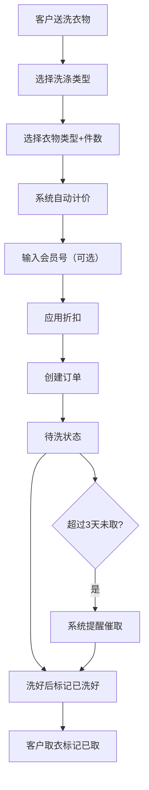

## 1. 产品概述

面向小型洗衣店的订单管理系统，帮助店主管理水洗和干洗订单、自动计算价格、会员折扣、取衣提醒以及月度经营统计。

- 主要解决：手工记账繁琐、价格容易算错、客户取衣容易忘记、月底统计耗时
- 目标用户：小型洗衣店店主或店员
- 产品价值：提升工作效率、减少价格计算错误、及时提醒超期未取衣物、快速掌握经营数据

## 2. 核心功能

### 2.1 用户角色
| 角色 | 注册方式 | 核心权限 |
|------|----------|----------|
| 店主/店员 | 直接使用（无需登录） | 所有功能，创建订单、管理订单、查看统计 |

### 2.2 功能模块
1. **仪表盘首页**：今日概览、超期提醒、快捷入口
2. **订单管理**：创建订单、订单列表、订单详情、状态流转（待洗→洗好→已取）
3. **统计报表**：月度统计、客户消费排行

### 2.3 页面详情
| 页面名称 | 模块名称 | 功能描述 |
|-----------|-------------|---------------------|
| 仪表盘 | 今日概览卡片 | 显示今日订单数、今日收入、待取衣物数 |
| 仪表盘 | 超期提醒列表 | 显示超过3天未取的订单，高亮提醒 |
| 仪表盘 | 快捷操作 | 快速创建新订单、查看全部订单 |
| 订单管理 | 订单列表 | 按状态筛选订单、搜索客户姓名/手机号 |
| 订单管理 | 创建订单表单 | 选择水洗/干洗、衣物类型、输入件数、客户信息、会员号 |
| 订单管理 | 订单详情 | 显示订单完整信息、修改状态、计算总价 |
| 统计报表 | 月度汇总 | 本月总件数、水洗件数、干洗件数、总收入 |
| 统计报表 | 客户排行 | 本月消费金额最高的前10名客户 |

## 3. 核心流程

客户送洗衣物 → 店主选择洗涤类型（水洗/干洗）→ 选择衣物类型并输入件数 → 系统自动计算价格 → 输入会员号享受折扣 → 创建订单 → 衣物洗好后标记"已洗好" → 客户取衣时标记"已取走" → 超过3天未取系统自动提醒 → 月底查看经营统计数据

## 4. 用户界面设计

### 4.1 设计风格
- **主色调**：清爽天蓝色 `#0ea5e9`（代表干净、水）
- **辅助色**：活力绿色 `#10b981`（表示洗好、完成）
- **警告色**：温暖橙色 `#f97316`（超期提醒）
- **中性色**：zinc系列灰
- **按钮风格**：圆角大按钮，悬停有微缩放和阴影
- **字体**：使用现代无衬线字体
- **布局风格**：卡片式布局，左侧导航栏 + 右侧内容区
- **图标**：使用 lucide-react 图标库

### 4.2 页面设计概述
| 页面名称 | 模块名称 | UI元素 |
|-----------|-------------|-------------|
| 仪表盘 | 今日概览 | 四张统计卡片带图标和数字动画 |
| 仪表盘 | 超期提醒 | 橙色高亮卡片列表，显示客户信息和超期天数 |
| 订单管理 | 订单列表 | 表格形式，状态标签颜色区分，支持筛选 |
| 订单管理 | 创建订单 | 分步表单，衣物选择卡片式，价格实时显示 |
| 统计报表 | 月度汇总 | 大号数字统计卡 + 水洗/干洗占比柱状图 |
| 统计报表 | 客户排行 | 带排名序号的列表，前三名有特殊标识 |

### 4.3 响应式
桌面端优先设计，平板自适应。考虑到洗衣店主要在电脑上使用，重点优化桌面端体验。
