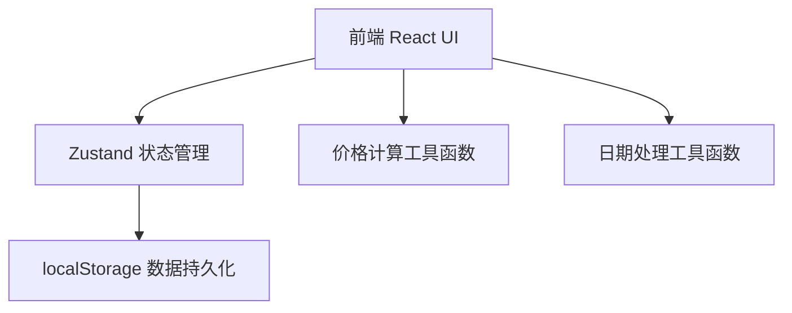
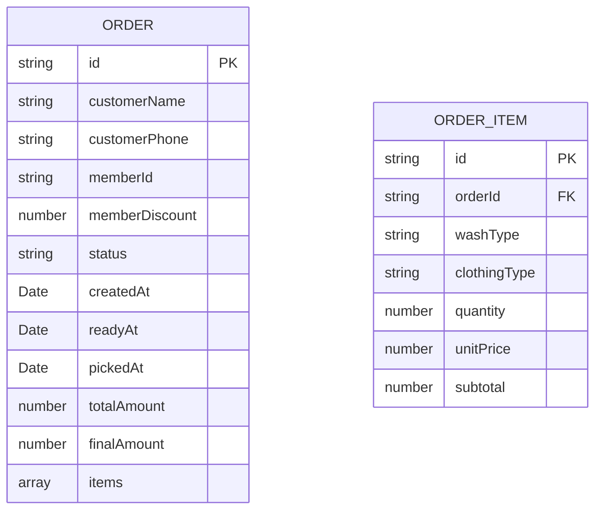

## 1. 架构设计



## 2. 技术描述

- **前端**：React@18 + TypeScript + tailwindcss@3 + vite
- **状态管理**：zustand
- **路由**：react-router-dom
- **图标**：lucide-react
- **数据存储**：浏览器 localStorage（无需后端，适合小型单店使用）
- **初始化工具**：vite-init

## 3. 路由定义

| Route | Purpose |
|-------|---------|
| / | 仪表盘首页 - 今日概览和超期提醒 |
| /orders | 订单列表 - 所有订单的管理页面 |
| /orders/new | 创建订单 - 新建洗衣订单 |
| /orders/:id | 订单详情 - 查看和编辑单个订单 |
| /statistics | 统计报表 - 月度统计和客户排行 |

## 4. 数据模型

### 4.1 数据模型定义



### 4.2 类型定义

```typescript
// 洗涤类型
type WashType = 'water' | 'dry';

// 衣物类型
type ClothingType = 'shirt' | 'pants' | 'coat' | 'bedding';

// 订单状态
type OrderStatus = 'pending' | 'ready' | 'picked';

// 价格配置
interface PriceConfig {
  water: Record<ClothingType, number>;
  dry: Record<ClothingType, number>;
}

// 订单项
interface OrderItem {
  id: string;
  washType: WashType;
  clothingType: ClothingType;
  clothingTypeName: string;
  washTypeName: string;
  quantity: number;
  unitPrice: number;
  subtotal: number;
}

// 订单
interface Order {
  id: string;
  customerName: string;
  customerPhone: string;
  memberId?: string;
  memberDiscount: number;
  status: OrderStatus;
  items: OrderItem[];
  totalAmount: number;
  finalAmount: number;
  createdAt: string;
  readyAt?: string;
  pickedAt?: string;
}

// 会员
interface Member {
  id: string;
  name: string;
  phone: string;
  discount: number;
}
```

### 4.3 初始价格配置

```javascript
const PRICE_CONFIG: PriceConfig = {
  water: {
    shirt: 10,    // 水洗衬衫 10元
    pants: 10,    // 水洗裤子 10元
    coat: 15,     // 水洗外套 15元
    bedding: 25,  // 水洗被套 25元
  },
  dry: {
    shirt: 20,    // 干洗衬衫 20元
    pants: 20,    // 干洗裤子 20元
    coat: 30,     // 干洗外套 30元
    bedding: 40,  // 干洗被套 40元
  }
};
```

## 5. 核心工具函数

```typescript
// 计算单个订单项价格
calculateItemPrice(washType, clothingType, quantity): number

// 计算订单总价（所有订单项之和）
calculateTotalAmount(items: OrderItem[]): number

// 计算会员折扣后价格
calculateFinalAmount(totalAmount: number, discount: number): number

// 判断订单是否超期（超过3天未取）
isOverdue(order: Order): boolean

// 获取超期天数
getOverdueDays(order: Order): number

// 获取指定月份的订单
getOrdersByMonth(orders: Order[], year: number, month: number): Order[]

// 月度统计数据
getMonthlyStatistics(orders: Order[], year: number, month: number): Stats

// 客户消费排行
getCustomerRanking(orders: Order[], year: number, month: number): CustomerRank[]
```
